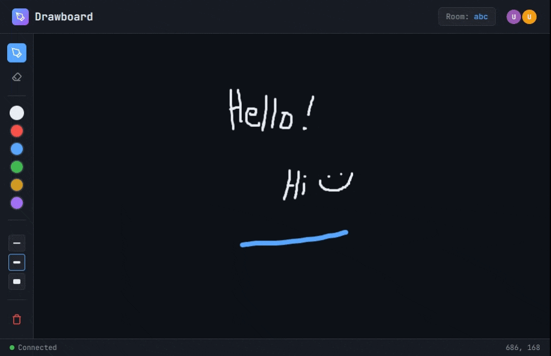

# WebSocket Drawing Board

A simple local implementation of WebSockets written in Go.

I was learning about HTTP and decided to try my hand working with WebSockets. HTML canvas was way more robust than I expected.

## Features

- Real-time collaborative drawing canvas
- Room-based sessions - share a room code to draw together
- Live cursor tracking for all connected users
- Drawing tools: pen, eraser, color picker, stroke width
- Canvas state syncs automatically for late joiners

## Prerequisites

- Go 1.21 or later

## Running the Server

```bash
go run .
```

The server starts on `http://localhost:8080`.

## Screenshot

